- Xanthophyll cycle

 
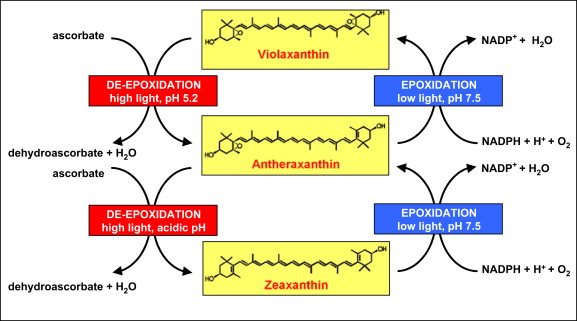

- Kautsky effect

- ABA biosynthetic pathway
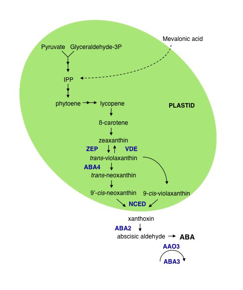

- Cytokinin biosynthetic pathway

Trans-CK 
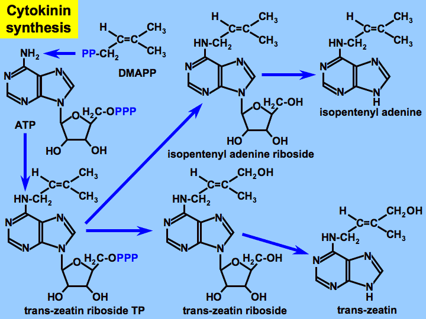

Trans- and Cis-CK 
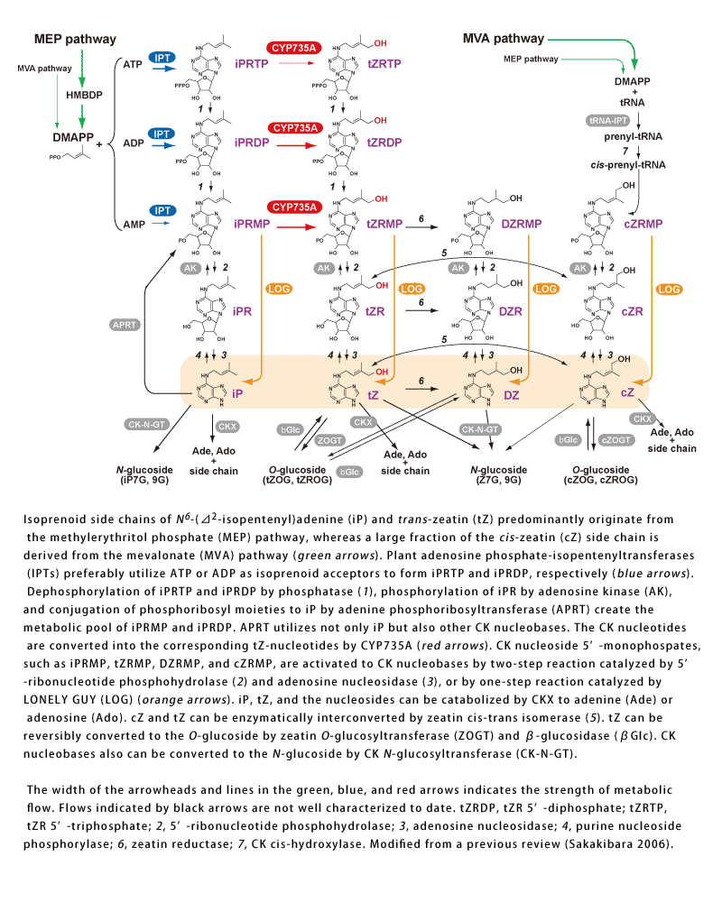

- Pathway of Jasmonic acid biosynthesis
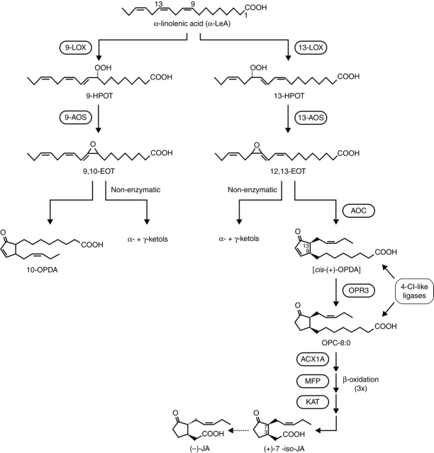

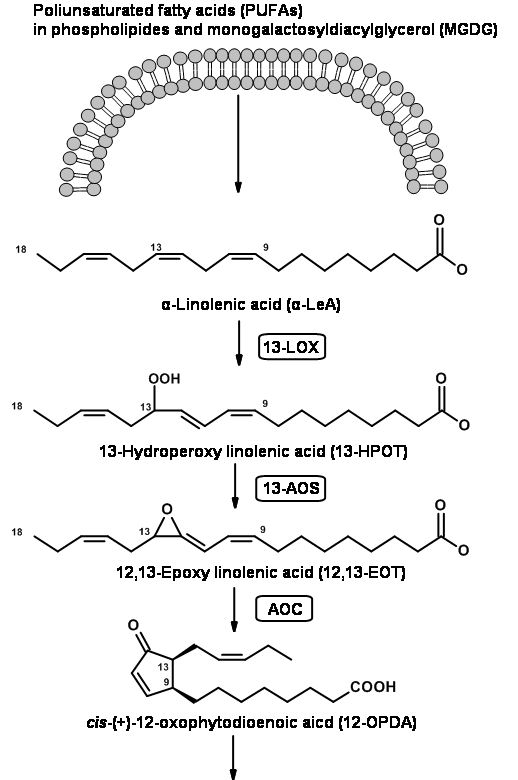
   
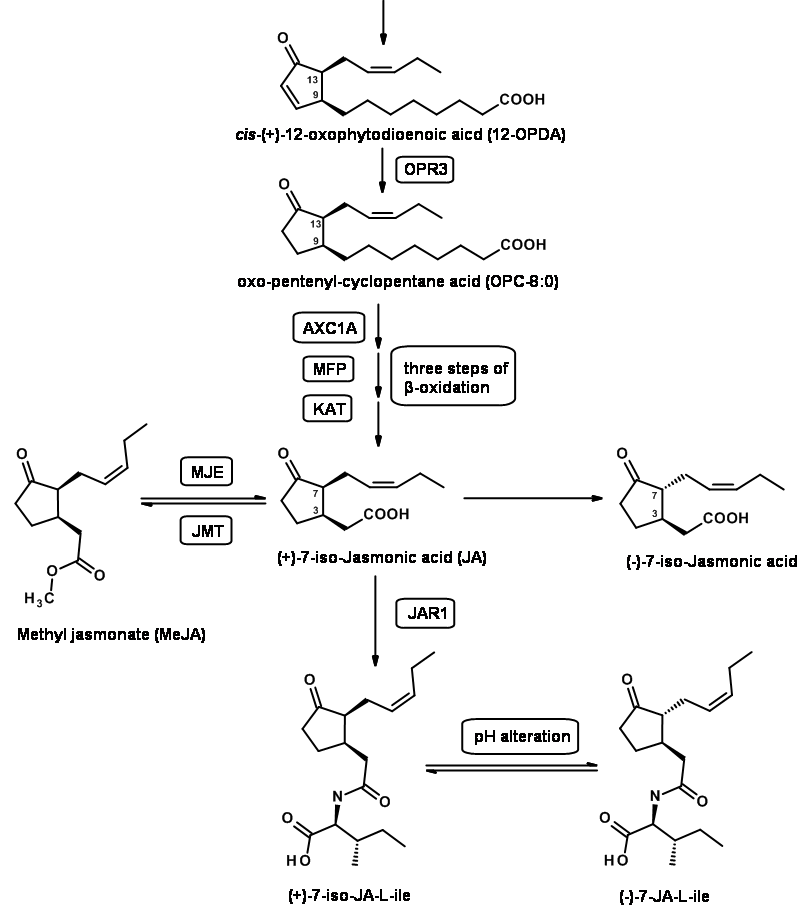 

- Light phase of photosynthesis

 
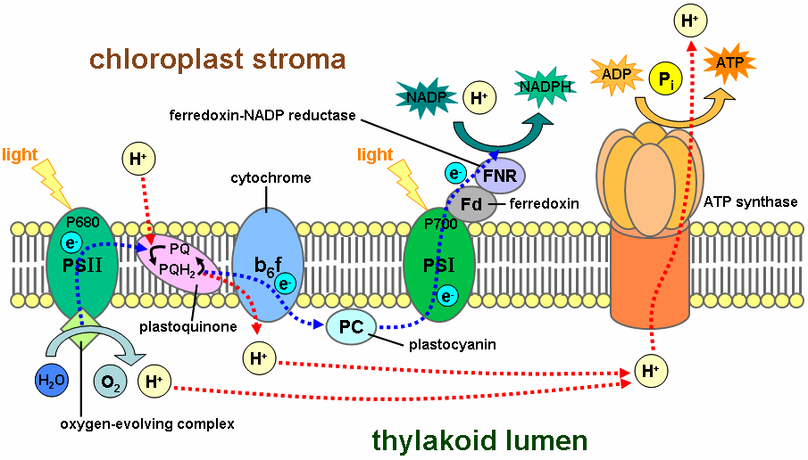 
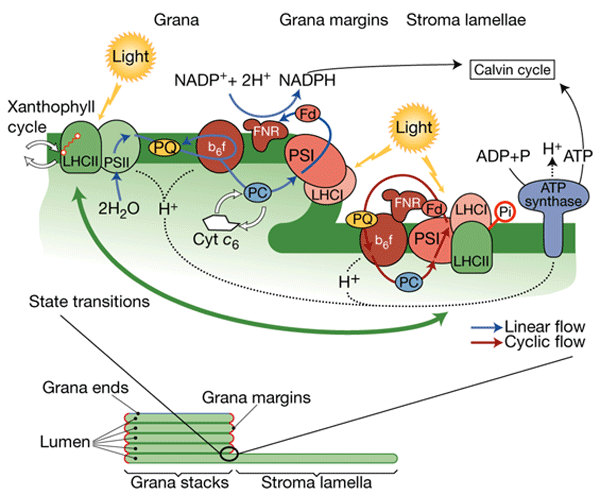 

- Z-scheme

 
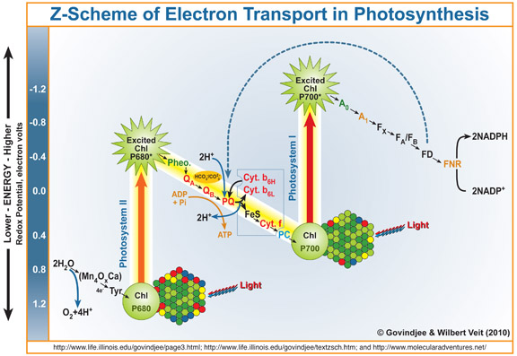 
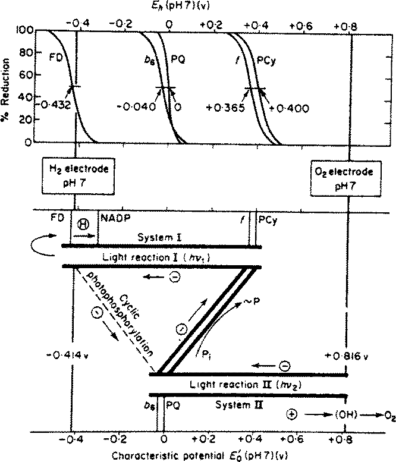 

