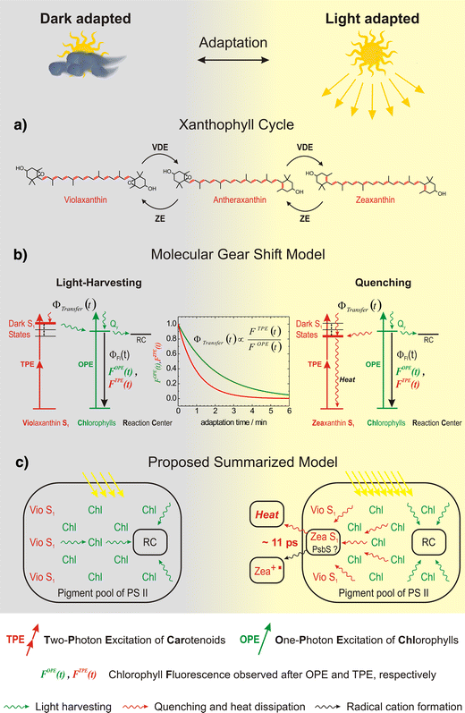
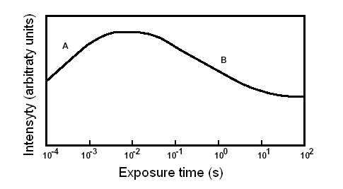

- Xanthophyll cycle

 

- Kautsky effect

- ABA biosynthetic pathway

- Cytokinin biosynthetic pathway

Trans-CK 

Trans- and Cis-CK 

- Pathway of Jasmonic acid biosynthesis

   
 

- Light phase of photosynthesis

 
 
 

- Z-scheme

 
 
 

